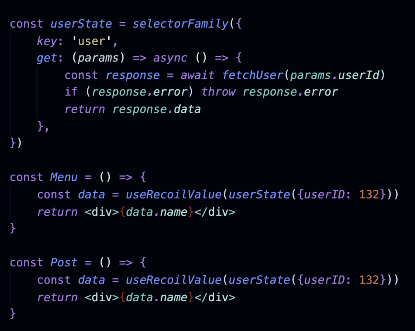

# Excalidraw Clone built with Recoil

This is the start of an [Exaclidraw](https://excalidraw.com/) clone that I am building with [Recoil](https://recoiljs.org/).

## What you'll learn to build in the course (on top of what's already in this repo)...

-   🔄 Rotating shapes
-   ✌️ Multi-select
-   🔵 More kinds of shapes
-   💾 Saving a drawing to a file and opening it again
-   🌍 Saving the drawing to a server (shareable drawing URL)
-   🌄 Loading content (e.g. images) from an API with Recoil and Suspense
-   👯‍♂️ Enabling concurrent mode
-   🧪 Adding full test coverage
-   🤔 Your own dev tools for debugging
-   🔑 Authentication
-   🏃 Performance debugging, testing, and improvement
-   And more...


### AtomFamily

For example, you have list of elements. We want to avoid that single elemenet got changed, whole list got re-render. Also want to share the single element state to other component. We can use `atom` (for list) and `atomFmaily` (for each element)

[PS] Using Redux with selector can also achieve this

for the list itself, you can use `atom` to model it.

for each elements in the list, can use `atomFamily`, it is a high order function which accept a param, for list of elements, the params would be the `id` of each element.

It is easy to get each element by using `useRecoilState(elementAtom(id))`, and those state are shareable with other component.


```tsx
// list
export const elementsAtom = atom<number[]>({
    key: 'elementsState',
    default: [],
})

// each element
export const elementAtom = atomFamily<Element, number>({
    key: 'elementState',
    default: {
        style: {
            position: {top: 50, left: 50},
            size: {width: 50, height: 50},
        },
    },
})

const [element, setElement] = useRecoilState(elementAtom(id))
```


### SelectorFamily

Benefits of Selectors:

* Get and Set logic combined
* Same API as Atoms
* Shareable, self-containaed state
* Async data fetching
  * Has caching built-in for the same params
  * **Handle race condition for you when data fetching**

Reaons to use `SelectorFamily`:

* Similar concept as `factory`
* The params should be `serialisable`
    * Recoil compare the param by `value` not by `reference`
    * `selectorFamily({userId: 1}) === selectorFamily({userId: 1})`
    * 
    * In `Menu` & `Post` both call `userState`, but data fetch only once

```tsx
export const editPropertiesState = selectorFamily<number, {path: string; id: number}>({
    key: 'editPropertiesState',
    get:
        ({path, id}) =>
        ({get}) => {
            const element = get(elementAtom(id))
            return lodash_get(element, path)
        },
    set:
        ({path, id}) =>
        ({get, set}, newValue) => {
            const element = get(elementAtom(id))
            const newElement = produce(element, (draft) => {
                lodash_set(element, path, newValue)
            })
            set(elementAtom(id), newElement)
        },
})
```

### How to refetch data by using selector/selectorFamily

```tsx
const weatherState = selectorFamily({
    key: 'weather',
    get:
        (userId: number) =>
        async ({get}) => {
            get(weatherRequestIdState(userId))
            const user = get(userState(userId))
            const weather = await getWeather(user.address.city)
            return weather
        },
})

// #region refetch
/* Refetch request by using selector */
// 1. create a request Id atom
const weatherRequestIdState = atomFamily({
    key: 'weatherRequestId',
    default: 0,
})
// 2. create a custom hook to increase the request id
const useRefetchWeather = (userId: number) => {
    const setRequestId = useSetRecoilState(weatherRequestIdState(userId))
    return () => setRequestId((id) => id + 1)
}
// 3. call get(weatherRequestIdState(userId)) in selectFamily where requrest need to be refetch
// 4. Use useRefetchWeather(userId) hook
// #endregion

export const UserWeather = ({userId}: {userId: number}) => {
    const weather = useRecoilValue(weatherState(userId))
    const userData = useRecoilValue(userState(userId))
    const refetch = useRefetchWeather(userId)
    return (
        <>
            <Text>
                <b>Weather for {userData.address.city}: </b> {weather} C
            </Text>
            <Text onClick={refetch}>(Refresh weather)</Text>
        </>
    )
}
```